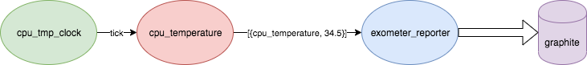

# Pipelines

This doc describes how to build pipelines and represent them in the `sys.config` file.

## Simple Pipeline

This pipeline consists of CPU temperature sensor for RPi.



Which will be represented by following config:

```erlang
{smart_house_node,[
        {config, [
            {pipe_sup, {cpu_temp_pipe_sup, [
                {clock_tick, [cpu_tmp_clock, 1000, cpu_temperature_tick_group]},
                {cpu_temperature,
                #{
                    name => cpu_temperature,
                    init_module => cpu_temperature,
                    init_args => [],
                    measurement_module => cpu_temperature,
                    measurement_args => [],
                    consumer_groups => [cpu_temperature_tick_group],
                    producer_groups => [cpu_temperature_reporter_group]
                }},
                {exometer_reporter,
                    #{
                        name => cpu_temp_exometer_reporter,
                        reporter_module => exometer_reporter,
                        reporter_init_args => [],
                        consumer_group => cpu_temperature_reporter_group
                    }
                }
            ]}}
        ]}
]}
```

Pipeline is wrapped with pipeline supervisor `pipe_sup`.